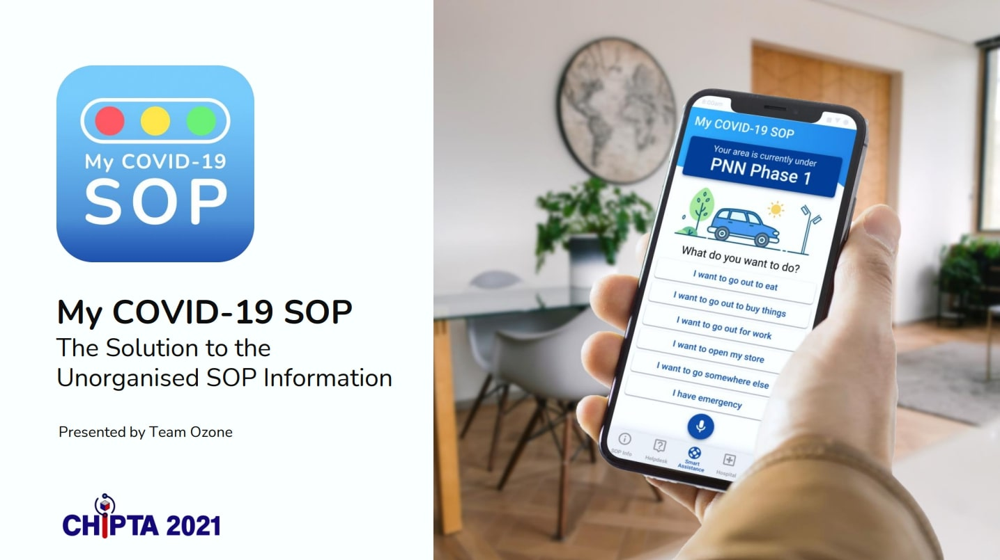

# My COVID-19 SOP
## Solution to the Unorganised SOP Information  
My COVID-19 SOP is the one-stop solution
for citizens to easily access organized and
detailed SOP information with frontier
technologies. This application also provide
smart assistant to user when outing to avoid
SOP violation.

Link to wireframe: [Figma Link](https://www.figma.com/file/RexyAAStMiLHr8RN8kSANX/Mobile-Apps-Wireframe?node-id=0%3A1)

## Working Features on this prototype
1. Voice Recognition
2. Google Geo Mapping

## Technology stack
- Front end: React Native (This repo)
Cross-platform Mobile UI software framework
- Back end: Google Cloud Functions  
Google's serverless compute solution for creating event driven application

## Contributors
- [Ting Wei Jing](https://github.com/TINGWEIJING)
- [Ng Yong Ming](https://github.com/YongMing11)
- [Chooi He Lin](https://github.com/HeLinChooi)